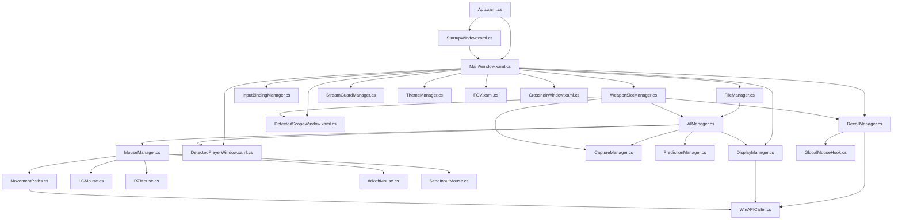
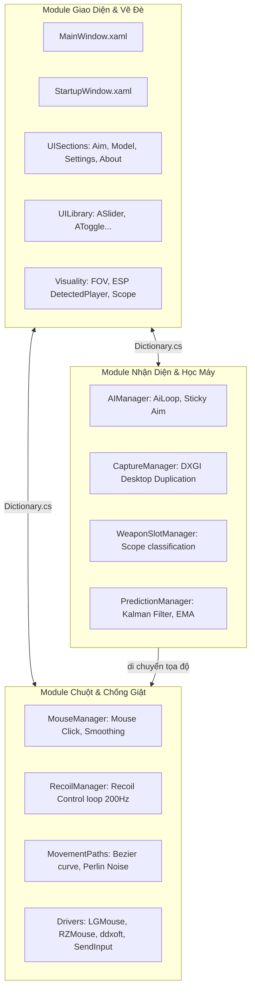

# TÀI LIỆU KỸ THUẬT TOÀN DIỆN DỰ ÁN AIMMY 2.5 (V1.7)

---

## 00. Tổng Quan Dự Án
S
Dự án **Aimmy 2.5 (Update V1.6.2)** là một phần mềm hỗ trợ nhắm mục tiêu (Aim Assist / Anti-Recoil) thời gian thực sử dụng trí tuệ nhân tạo (AI) chạy qua mô hình ONNX Runtime và giả lập chuột ở mức độ Kernel Driver để tránh các hệ thống bảo vệ (Anti-Cheat) của trò chơi.

### Mục Đích Dự Án
* **Aimmy 2.5** được thiết kế nhằm hỗ trợ người chơi game bắn súng góc nhìn thứ nhất (FPS) hoặc góc nhìn thứ ba (TPS) bằng cách tự động hóa hoặc hỗ trợ việc nhắm bắn vào mục tiêu (đối thủ) và triệt tiêu độ giật của vũ khí (Anti-Recoil).
* Ứng dụng chụp lại màn hình trò chơi theo thời gian thực, đưa hình ảnh qua mô hình AI (YOLO) để nhận diện vị trí đối thủ, và điều khiển con trỏ chuột di chuyển mượt mờ về phía đối thủ đó.

### Đối tượng sử dụng
* Người chơi game bắn súng có nhu cầu hỗ trợ ngắm bắn.
* Các lập trình viên hoặc kỹ sư nghiên cứu về ứng dụng Trí tuệ nhân tạo (Computer Vision) trong việc xử lý hình ảnh thời gian thực, chụp màn hình tốc độ cao và tương tác thiết bị ngoại vi trên Windows.

### Chức năng chính
1. **Hỗ trợ nhắm bắn AI (Aim Assist)**: Nhận diện kẻ địch thông qua mô hình YOLOv8 hoặc YOLOv10/11/26 (dạng Standard hoặc NMS-Free) bằng định dạng ONNX (tăng tốc DirectML cho mọi GPU) hoặc TensorRT Engine (`.engine`, `.trt`) tăng tốc chuyên sâu cho GPU NVIDIA (CUDA 12.x/TensorRT 10.x).
2. **Khóa mục tiêu thông minh (Sticky Aim)**: Giữ hồng tâm ổn định trên một kẻ địch cụ thể, tránh việc giật chuột liên tục giữa nhiều mục tiêu khác nhau. Có cơ chế tự động ước lượng vị trí dựa trên vận tốc cũ khi mục tiêu bị khuất bóng tạm thời (Hysteresis / Grace Period).
3. **Đón đầu mục tiêu (Prediction)**: Tích hợp nhiều thuật toán dự đoán chuyển động (Kalman Filter, Shall0e's, WiseTheFox's EMA, Constant Acceleration) để nhắm đón đầu các mục tiêu đang chạy nhanh.
4. **Tự động kích nổ / Click chuột (Auto Trigger / Triggerbot)**: Tự động click chuột khi hồng tâm nằm đè lên mục tiêu. Hỗ trợ chế độ nhấp nhả (Single Click) hoặc bắn liên tục (Spray Mode).
5. **Vẽ đè thông tin hiển thị (Visual ESP / Overlay)**: Vẽ vòng tròn trường nhìn (FOV Window), khung xương/hộp giới hạn quanh kẻ địch phát hiện (`DetectedPlayerWindow`), tâm ngắm ảo (`CrosshairWindow`).
6. **Nhận diện súng & Ống ngắm (Weapon Recognition)**: Quét hình ảnh biểu tượng súng và ống ngắm khi người dùng nhấn mở túi đồ (Tab), sử dụng mô hình ONNX phụ (`scope.onnx`) để tự động phân loại loại ống ngắm (8x, 6x, 4x, 3x, 2x, chấm đỏ, mở rộng).
7. **Chống giật theo từng ống ngắm (Scope Recoil Control)**: Áp dụng lực kéo chuột đi xuống theo trục Y tương ứng với ống ngắm đang gắn. Chống giật chia làm 4 giai đoạn (Stage 1-4) để mô phỏng chính xác hành vi giật của từng loại súng. Hỗ trợ điều chỉnh lực chống giật nhanh bằng con lăn chuột (Mouse Wheel Adjust).
8. **Giả lập chuột Kernel Driver**: Hỗ trợ di chuyển chuột qua driver chính thức của Logitech G HUB, Razer Synapse, hoặc Driver ảo ddxoft bên cạnh cơ chế Windows API truyền thống để vượt qua sự phát hiện của Anti-Cheat.
9. **Chống Stream (StreamGuard)**: Ẩn hoàn toàn các cửa sổ overlay (FOV, ESP) khỏi các ứng dụng quay phim/chụp màn hình như OBS Studio, Discord, hay TeamViewer.

---

### Công Nghệ Sử Dụng

Dự án được xây dựng trên nền tảng công nghệ Microsoft Windows, cụ thể:
* **Ngôn ngữ lập trình**: C# (phiên bản 10.0+), chạy trên nền `.NET 8.0` / `.NET Core` (WPF Desktop App).
* **Giao diện người dùng**: **WPF (Windows Presentation Foundation)** kết hợp XAML. Sử dụng các kỹ thuật animation mượt mà (DoubleAnimation, TranslateTransform) và Canvas đồ họa để vẽ overlay.
* **Thư viện học máy (Machine Learning SDK)**:
  * `Microsoft.ML.OnnxRuntime` (v1.17+): Chạy suy luận mô hình AI định dạng `.onnx` ở mức hiệu năng cực cao.
  * Hỗ trợ **DirectML (DML)** qua `AppendExecutionProvider_DML()` để tận dụng sức mạnh GPU (DirectX 12) của tất cả các hãng AMD, Nvidia, Intel, tăng tốc độ xử lý hình ảnh và giảm tải CPU.
  * Hỗ trợ **TensorRT C-API** thông qua NuGet package `JYPPX.TensorRT.CSharp.API` kết hợp CUDA 12.x và TensorRT 10.x để tối ưu hóa suy luận tốc độ tối đa cho GPU NVIDIA bằng định dạng `.engine`/`.trt`.
* **Thư viện đồ họa & Chụp màn hình**:
  * `Vortice.Direct3D11` và `Vortice.DXGI`: Wrapper C# cho thư viện native DirectX 11 và DXGI của Windows, phục vụ chụp màn hình tốc độ cao (Desktop Duplication API) trực tiếp từ GPU.
  * `SharpGen.Runtime`: Hỗ trợ interop mã máy cho Vortice.
  * Thư viện `System.Drawing` (GDI+): Dùng để tiền xử lý hình ảnh (Bitmap) và làm cơ chế chụp màn hình dự phòng.
* **Xử lý JSON & Cấu hình**:
  * `Newtonsoft.Json`: Phân tích cú pháp và lưu trữ cấu hình dưới dạng tệp tin JSON phẳng (tệp `.cfg`).
* **Can thiệp hệ thống & Ngoại vi (Inter-Op)**:
  * Gọi hàm hệ thống không công bố (Undocumented Windows APIs) thông qua P/Invoke (`NtCreateFile`, `NtDeviceIoControlFile`) để giao tiếp với kernel driver của Logitech G HUB.
  * Nạp động thư viện liên kết động C++ (`LoadLibrary`, `GetProcAddress`) để gọi hàm từ `rzctl.dll` (Razer) và `DD64.dll` (ddxoft).

---

### Kiến Trúc Tổng Thể

Aimmy 2.5 được thiết kế theo mô hình **Kiến trúc phân tầng thực tế (Layered Architecture)** kết hợp với cơ chế quản lý trạng thái tập trung (**Centralized Dynamic State**).

Hệ thống được chia thành 5 tầng chính như sau:

```
┌─────────────────────────────────────────────────────────────┐
│                       Giao Diện (UI)                        │
│ (MainWindow, StartupWindow, UISections, UILibrary, Overlay) │
└──────────────┬──────────────────────────────┬───────────────┘
               │                              │
               ▼                              ▼
┌──────────────────────────────┐┌─────────────────────────────┐
│          Logic AI            ││         Logic Input         │
│ (AIManager, CaptureManager,  ││ (MouseManager, RecoilMgr,  │
│  WeaponSlotMgr, Prediction)  ││  Paths, GlobalMouseHook)   │
└──────────────┬───────────────┘└─────────────┬───────────────┘
               │                              │
               ▼                              ▼
┌─────────────────────────────────────────────────────────────┐
│                       Tiện Ích & OS                         │
│ (DisplayManager, FileManager, StreamGuard, NativeMethods)   │
└──────────────────────────────┬──────────────────────────────┘
                               ▼
┌─────────────────────────────────────────────────────────────┐
│                   Giao Tiếp Phần Cứng                       │
│ (SendInput, LGMouse Driver, Razer rzctl, ddxoft Virtual)    │
└─────────────────────────────────────────────────────────────┘
```

#### Chi tiết các tầng:
1. **Tầng Giao Diện (Presentation/UI Layer)**: Chịu trách nhiệm hiển thị bảng điều khiển trực quan và các overlay ESP/FOV trên màn hình game. Sử dụng Dispatcher của WPF để cập nhật giao diện không đồng bộ từ các luồng tính toán phía dưới.
2. **Tầng Logic AI (AI Logic Layer)**: Chạy luồng nhận diện mục tiêu độc lập (`AiLoop` trong [AIManager.cs](AILogic/AIManager.cs)) ở mức ưu tiên cao. Điều phối việc chụp màn hình, tiền xử lý ảnh, suy luận qua ONNX Runtime, lọc đối tượng ưu tiên (Đầu/Thân), bám dính mục tiêu và tính toán tọa độ ngắm bắn đón đầu. Chạy luồng nhận dạng ống ngắm ([WeaponSlotManager.cs](AILogic/WeaponSlotManager.cs)) để tự động hóa cấu hình chống giật.
3. **Tầng Logic Input & Điều Khiển (Input/Control Layer)**: Lắng nghe sự kiện phím nóng toàn cục và nút bấm chuột. Tính toán quỹ đạo di chuyển chuột (nội suy mượt, Perlin Noise, EMA). Chạy luồng chống giật độc lập (`RecoilLoop` trong [RecoilManager.cs](InputLogic/RecoilManager.cs) hoạt động ở tần số ~200Hz).
4. **Tầng Tiện Ích & Hệ Thống (System Utilities Layer)**: Cung cấp các chức năng hỗ trợ như lưu trữ config JSON, quản lý đa màn hình, kiểm tra môi trường hệ thống, và bảo mật Stream Guard chống lộ overlay.
5. **Tầng Giao Tiếp Driver & Win32 (Hardware/OS Interaction Layer)**: Giao tiếp trực tiếp với hệ điều hành Windows ở mức thấp thông qua P/Invoke và kernel driver để thực hiện di chuyển chuột ảo mà không bị phát hiện.

---

## 01. Cấu Trúc Thư Mục

Thư mục gốc của dự án chứa các file quản lý dự án (.sln, .csproj), các cấu hình build, và các thư mục mã nguồn được phân chia theo nhiệm vụ cụ thể:

```
Aimmy2.5_update_V1.3/
├── AILogic/                     # Logic AI, Chụp ảnh màn hình, Nhận dạng Scope
├── Class/                       # Lớp bổ trợ giao diện, lưu trữ biến toàn cục, hiệu ứng UI
├── Graphics/                    # Chứa phông chữ và tài nguyên đồ họa tĩnh
│   └── Fonts/
├── InputLogic/                  # Xử lý phím tắt, di chuyển chuột, chống giật (Recoil)
├── MouseMovementLibraries/      # Các module driver di chuột bên thứ ba (kernel level)
│   ├── GHubSupport/
│   ├── RazerSupport/
│   ├── SendInputSupport/
│   └── ddxoftSupport/
├── Other/                       # Tiện ích hệ thống (Đa màn hình, Quản lý file, Bảo mật, VC++)
├── UILibrary/                   # Thư viện các WPF Custom Control (Slider, Toggle, Dropdown...)
├── UISections/                  # Các tab giao diện chính (Aim, Model, Settings, About)
├── Visuality/                   # Các cửa sổ vẽ đè overlay lên game (FOV, ESP Boxes, Scope info)
├── WinformsReplacement/         # Wrapper gọi hàm Win32 API thay thế cho thư viện WinForms
├── bin/                         # Thư mục chứa file cấu hình chạy (.cfg, .txt) và ảnh chụp label
│   ├── configs/
│   ├── images/
│   └── labels/
├── icon/                        # Chứa icon của ứng dụng
├── loot/                        # Chứa tiến trình phụ trợ nhặt đồ nhanh (Loot.exe được biên dịch từ mã nguồn autohotkey Loot.ahk)
```

---

## 02. Danh Sách Tập Tin (File Directory List)

| Relative Path | Loại File | Chức Năng |
| :--- | :---: | :--- |
| **[App.xaml](App.xaml) / [App.xaml.cs](App.xaml.cs)** | WPF Startup | Entry Point khởi động ứng dụng, nạp màu sắc theme ban đầu và mở Splash Screen. |
| **[StartupWindow.xaml](StartupWindow.xaml) / [StartupWindow.xaml.cs](StartupWindow.xaml.cs)** | WPF Window | Splash Screen hiển thị lúc khởi động ứng dụng, tạo hạt particle đồ họa và nạp ngầm `MainWindow`. |
| **[MainWindow.xaml](MainWindow.xaml) / [MainWindow.xaml.cs](MainWindow.xaml.cs)** | WPF Window | Cửa sổ điều phối trung tâm. Đọc/ghi cấu hình, quản lý phím tắt, xử lý tray icon và điều phối các menu chức năng. |
| **[ExitConfirmationWindow.xaml](ExitConfirmationWindow.xaml) / [ExitConfirmationWindow.xaml.cs](ExitConfirmationWindow.xaml.cs)** | WPF Window | Hộp thoại xác nhận khi bấm đóng ứng dụng (ẩn xuống System Tray hay tắt hoàn toàn). |
| **[AssemblyInfo.cs](AssemblyInfo.cs)** | C# Code | Lưu trữ thông tin metadata của assembly (phiên bản, tên ứng dụng, bản quyền). |
| **[AILogic/AIManager.cs](AILogic/AIManager.cs)** | C# Code | Quản lý logic AI. Vòng lặp nhận dạng địch ONNX, Sticky Aim, lọc FOV, chọn mục tiêu bắn và tự click chuột. |
| **[AILogic/CaptureManager.cs](AILogic/CaptureManager.cs)** | C# Code | Chụp màn hình vùng quét thông qua DirectX 11 (DXGI Desktop Duplication) hoặc GDI+. |
| **[AILogic/MathUtil.cs](AILogic/MathUtil.cs)** | C# Code | Cung cấp các hàm toán học phụ trợ xử lý vector, đổi pixel ảnh sang float array chuẩn hóa cho model AI. |
| **[AILogic/PredictionManager.cs](AILogic/PredictionManager.cs)** | C# Code | Các thuật toán toán học ước lượng vị trí mục tiêu đón đầu (Kalman Filter, EMA, Constant Acceleration). |
| **[AILogic/WeaponSlotManager.cs](AILogic/WeaponSlotManager.cs)** | C# Code | Quản lý 2 slot vũ khí. Chạy luồng quét súng và nhận dạng ống ngắm qua ONNX, tự cập nhật recoil. |
| **[Class/Animator.cs](Class/Animator.cs)** | C# Code | Định nghĩa các hiệu ứng chuyển động mượt mà (Fade, Slide, Width/Height Shift) cho UI. |
| **[Class/ClickThroughOverlay.cs](Class/ClickThroughOverlay.cs)** | C# Code | Cung cấp các phương thức cài đặt style cửa sổ Windows qua Win32 API để cho phép click xuyên qua overlay. |
| **[Class/Dictionary.cs](Class/Dictionary.cs)** | C# Code | Lưu trữ trạng thái toàn cục của các thanh trượt (slider), nút bấm (toggle), danh sách chọn (dropdown) trên UI. |
| **[Class/PropertyChanger.cs](Class/PropertyChanger.cs)** | C# Code | Hỗ trợ binding dữ liệu WPF và đồng bộ hóa thông số thay đổi giữa UI và các cửa sổ overlay. |
| **[Class/SaveDictionary.cs](Class/SaveDictionary.cs)** | C# Code | Thực hiện lưu và tải trạng thái config ra/vào các tệp JSON phẳng (`.cfg`). |
| **[Class/UI.cs](Class/UI.cs)** | C# Code | Chứa các tham chiếu và thuộc tính đại diện cho các control giao diện. |
| **[InputLogic/GlobalMouseHook.cs](InputLogic/GlobalMouseHook.cs)** | C# Code | Cài đặt hook chuột mức hệ thống bằng Win32 API để nhận sự kiện cuộn chuột nhằm căn chỉnh lực chống giật. |
| **[InputLogic/InputBindingManager.cs](InputLogic/InputBindingManager.cs)** | C# Code | Quản lý và lắng nghe sự kiện phím nóng toàn hệ thống để bật/tắt tính năng hoặc kích hoạt aimbot. |
| **[InputLogic/MouseManager.cs](InputLogic/MouseManager.cs)** | C# Code | Điều khiển chuột (di chuyển và click) theo các driver phần cứng ảo, hiệu chỉnh góc nghiêng và làm mượt đường đi. |
| **[InputLogic/MovementPaths.cs](InputLogic/MovementPaths.cs)** | C# Code | Thuật toán tạo đường đi tự nhiên mô phỏng tay người (Bezier, Perlin Noise, Lerp). |
| **[InputLogic/RecoilManager.cs](InputLogic/RecoilManager.cs)** | C# Code | Xử lý chống giật 4 giai đoạn bằng luồng ngầm 200Hz, kéo chuột dọc trục Y khi giữ bắn. |
| **[MouseMovementLibraries/GHubSupport/LGMouse.cs](MouseMovementLibraries/GHubSupport/LGMouse.cs)** | C# Code | Driver giao tiếp mức kernel với Logitech G HUB bằng Win32 API `NtDeviceIoControlFile`. |
| **[MouseMovementLibraries/GHubSupport/LGHubMain.cs](MouseMovementLibraries/GHubSupport/LGHubMain.cs)** | C# Code | Khởi tạo kết nối driver Logitech G HUB và tải DLL LGMouse nếu cần. |
| **[MouseMovementLibraries/GHubSupport/LGDownloader.xaml.cs](MouseMovementLibraries/GHubSupport/LGDownloader.xaml.cs)**| C# Code | Logic hỗ trợ tự động tải phiên bản Logitech G HUB 2021 tương thích nếu phát hiện phiên bản mới không chạy được. |
| **[MouseMovementLibraries/RazerSupport/RZMouse.cs](MouseMovementLibraries/RazerSupport/RZMouse.cs)** | C# Code | Giao tiếp với driver giả lập chuột Razer thông qua thư viện C++ `rzctl.dll`. |
| **[MouseMovementLibraries/SendInputSupport/SendInputMouse.cs](MouseMovementLibraries/SendInputSupport/SendInputMouse.cs)**| C# Code | Giả lập chuột thông qua hàm API mặc định của Windows `SendInput`. |
| **[MouseMovementLibraries/ddxoftSupport/ddxoftMain.cs](MouseMovementLibraries/ddxoftSupport/ddxoftMain.cs)** | C# Code | Khởi tạo driver ảo ddxoft và ánh xạ các hàm từ file DLL. |
| **[MouseMovementLibraries/ddxoftSupport/ddxoftMouse.cs](MouseMovementLibraries/ddxoftSupport/ddxoftMouse.cs)** | C# Code | Điều khiển chuột thông qua driver ảo ddxoft (`DD64.dll`). |
| **[Other/DisplayManager.cs](Other/DisplayManager.cs)** | C# Code | Quản lý thông tin đa màn hình, đồng bộ hóa vị trí các cửa sổ overlay khi cắm/rút màn hình. |
| **[Other/FileManager.cs](Other/FileManager.cs)** | C# Code | Tải danh sách model AI, danh sách file config lên giao diện; điều phối load model mới vào AIManager. |
| **[Other/GetSpecs.cs](Other/GetSpecs.cs)** | C# Code | Lấy thông tin cấu hình phần cứng của PC (CPU, GPU, dung lượng RAM) sử dụng WMI Query. |
| **[Other/GithubManager.cs](Other/GithubManager.cs)** | C# Code | Kết nối Github API để kiểm tra phiên bản mới, tải các file model/config được chia sẻ. |
| **[Other/KeybindNameManager.cs](Other/KeybindNameManager.cs)** | C# Code | Chuyển đổi mã phím ảo của Windows (Virtual Key) sang chuỗi ký tự thân thiện để hiển thị trên UI. |
| **[Other/LogManager.cs](Other/LogManager.cs)** | C# Code | Ghi log hoạt động của ứng dụng ra tệp `bin\\log.txt`. |
| **[Other/RequirementsManager.cs](Other/RequirementsManager.cs)** | C# Code | Kiểm tra các yêu cầu hệ thống như VC++ Redistributable, Memory Integrity, và driver G HUB phù hợp. |
| **[Other/StreamGuardManager.cs](Other/StreamGuardManager.cs)** | C# Code | Bảo mật chống stream, gọi Win32 API `SetWindowDisplayAffinity` ẩn overlay khỏi OBS Studio/Discord. |
| **[Other/ThemeManager.cs](Other/ThemeManager.cs)** | C# Code | Quản lý màu sắc theme và tài nguyên brush động của ứng dụng WPF. |
| **[Other/UpdateManager.cs](Other/UpdateManager.cs)** | C# Code | Xử lý tải xuống các tệp cập nhật phần mềm mới từ Github. |
| **[UISections/AimMenuControl.xaml.cs](UISections/AimMenuControl.xaml.cs)** | C# Code | Giao diện Tab Aim: Điều phối toàn bộ các slider/toggle cấu hình aimbot súng. |
| **[UISections/ModelMenuControl.xaml.cs](UISections/ModelMenuControl.xaml.cs)** | C# Code | Giao diện Tab Model: Hiển thị danh sách model AI, nút tải và chọn model. |
| **[UISections/SettingsMenuControl.xaml.cs](UISections/SettingsMenuControl.xaml.cs)** | C# Code | Giao diện Tab Settings: Chọn driver chuột, capture method, và cài đặt phím. |
| **[UISections/AboutMenuControl.xaml.cs](UISections/AboutMenuControl.xaml.cs)** | C# Code | Giao diện Tab About: Giới thiệu phần mềm, hiển thị cấu hình phần cứng PC. |
| **[WinformsReplacement/GetScalingFactor.cs](WinformsReplacement/GetScalingFactor.cs)**| C# Code | Hàm Win32 API lấy hệ số DPI Scaling hiện tại của Windows. |
| **[WinformsReplacement/NativeMethods.cs](WinformsReplacement/NativeMethods.cs)** | C# Code | Khai báo các hằng số và cấu trúc struct phục vụ gọi hàm Win32 API cấp thấp. |
| **[WinformsReplacement/WinAPICaller.cs](WinformsReplacement/WinAPICaller.cs)** | C# Code | Wrapper thực hiện gọi các hàm Win32 API (lấy vị trí chuột, kích thước màn hình). |

---

## 03. Phân Tích Tập Tin Chi Tiết (Detailed File Analysis)

### App.xaml.cs
* **Mục đích**: Điểm vào (Entry point) của ứng dụng, thiết lập môi trường DLL, khởi tạo theme màu và quản lý vòng đời khởi động của các cửa sổ. Hỗ trợ xác thực thầm lặng file engine để tránh lỗi tương thích GPU.
* **Namespace**: `Aimmy2`
* **Class**: `App` (kế thừa `System.Windows.Application`)
* **Method**:
  * `OnStartup(...)`: Đăng ký sự kiện khởi động. Nạp đường dẫn DLL. Nếu tham số dòng lệnh chứa cờ xác thực `--validate-engine`, hàm sẽ gọi Win32 `SetErrorMode` để tắt các hộp thoại lỗi hệ thống, thử tải engine và trả về exit code `0` hoặc `1` để xác định tính tương thích. Ngược lại, tiếp tục khởi chạy hoạt ảnh `StartupWindow` (ở chế độ Release) hoặc hiển thị trực tiếp `MainWindow` (ở chế độ Debug).
  * `ConfigureDllPaths()`: Tìm kiếm và đưa đường dẫn thư mục cài đặt CUDA (`bin/`) và TensorRT vào biến môi trường `PATH` của tiến trình để các API suy luận có thể liên kết động.

---

### StartupWindow.xaml.cs
* **Mục đích**: Hiển thị hoạt ảnh khởi động (Splash Screen) và khởi tạo ngầm `MainWindow` để tránh giật lag giao diện.
* **Namespace**: `Aimmy2`
* **Class**: `StartupWindow` (kế thừa `System.Windows.Window`)
* **Method**:
  * `Window_Loaded(...)`: Nạp giao diện, tạo các hạt particle ngẫu nhiên, chạy storyboard hiệu ứng chữ, gọi `PreloadMainWindowAsync()` rồi chuyển giao diện mượt mà sang `MainWindow`.
  * `PreloadMainWindowAsync()`: Tạo một thực thể `MainWindow` ẩn ngoài vùng nhìn thấy (`Left=-10000`) để nạp tài nguyên.
  * `StartSmoothTransition()`: Chạy hoạt ảnh mở rộng cửa sổ và chuyển giao sang `MainWindow`.
  * `OnRendering(...)`: Lắng nghe chu kỳ vẽ của WPF (`CompositionTarget.Rendering`) để cập nhật hoạt ảnh cắt cúp mặt nạ (`RevealClip`).
* **Được gọi bởi**: `App.OnStartup(...)`.
* **Gọi tới**: [MainWindow.xaml.cs](MainWindow.xaml.cs).
* **Dependency**: `System.Windows.Media.Animation`, `System.Windows.Media.Effects`.
* **Luồng dữ liệu**: Vào: Không có. Ra: Thực thể `MainWindow` sẵn sàng hiển thị.
* **Tóm tắt logic**: Để mang lại trải nghiệm premium, ứng dụng sinh ra từ 12-20 hạt tròn bay ngẫu nhiên tránh vùng logo trung tâm. Trong lúc hoạt ảnh chạy, `MainWindow` được khởi tạo ngầm. Khi người dùng click chuột hoặc nhấn Space/Enter/Escape, hoặc sau 3.5 giây, ứng dụng sẽ chạy hoạt ảnh kéo giãn clip từ 280px lên toàn màn hình để hiện `MainWindow` một cách mượt mà.

---

### MainWindow.xaml.cs
* **Mục đích**: Cửa sổ chính điều phối toàn bộ tài nguyên, quản lý cấu hình, phím nóng toàn cục và đóng/tắt ứng dụng.
* **Namespace**: `Aimmy2`
* **Class**: `MainWindow` (kế thừa `System.Windows.Window`)
* **Method**:
  * `InitializeTrayIcon()`: Tạo icon khay hệ thống, gắn menu chuột phải (Open/Exit).
  * `StartLootProcess()` / `StopLootProcess()`: Khởi động/tắt tiến trình phụ trợ `Loot.exe` nằm trong thư mục `loot/`.
  * `Window_Loaded(...)`: Nạp các file config `.cfg`, khôi phục kích thước cửa sổ và gọi `InitializeApplicationAsync()`.
  * `InitializeApplicationAsync()`: Bật `DisplayManager`, tạo các cửa sổ overlay ESP/FOV, bật phím nóng, chạy `RecoilManager`.
  * `SaveAllConfigurations()`: Ghi đè toàn bộ giá trị cài đặt hiện tại trên UI xuống các file cấu hình tương ứng trong thư mục `bin\`.
  * `Window_Closing(...)`: Hỏi người dùng ẩn xuống Tray hay thoát. Khi thoát, giải phóng driver chuột, dừng luồng AI, tắt các overlay, lưu config.
  * `HandleKeybindPressed(...)` / `HandleKeybindReleased(...)`: Định tuyến hành động khi phím nóng được nhấn/thả.
  * `LoadConfig(...)`: Tải cấu hình cụ thể và cập nhật các slider, dropdown trên UI.

---

### AILogic/AIManager.cs
* **Mục đích**: Trái tim xử lý AI, thực hiện nhận diện mục tiêu, Sticky Aim, đón đầu chuyển động và kích hoạt di chuột. Hỗ trợ tải mô hình ONNX qua DirectML và mô hình TensorRT Engine (.engine, .trt) qua GPU NVIDIA.
* **Namespace**: `Aimmy2.AILogic`
* **Class**: `AIManager` (thực thi `IDisposable`)
* **Property**:
  * `Initialization`: Task đại diện cho tiến trình khởi tạo nạp mô hình nền của AIManager, giúp đồng bộ hóa tiến trình tải ở giao diện.
* **Method**:
  * `LoadModelAsync(...)`: Khởi tạo Inference Session ONNX hoặc nạp TensorRT Engine. Đối với ONNX, ưu tiên tăng tốc DirectML, nếu lỗi tự động fallback sang CPU. Đối với Engine, kiểm tra tương thích GPU trước khi thực thi.
  * `LoadSecondaryModel(...)`: Nạp mô hình phụ ở Slot 2 (ONNX hoặc TensorRT).
  * `ValidateTensorRTEngineSubprocess(...)`: Thực hiện khởi chạy tiến trình con với cờ `--validate-engine` để xác thực thầm lặng file engine có tương thích với GPU hiện tại hay không trước khi nạp chính thức.
  * `ValidateOnnxShape(...)`: Phân tích hình dạng tensor đầu ra của mô hình ONNX để phân biệt YOLOv8 (Standard NMS) hay YOLOv10/11/26 (NMS-Free).
  * `AiLoop()`: Vòng lặp nhận diện chạy trên luồng phụ (`ThreadPriority.AboveNormal`).
  * `GetClosestPrediction()`: Chụp màn hình qua `CaptureManager`, chuyển đổi dữ liệu ảnh thành tensor, chạy suy luận ONNX hoặc TensorRT, chọn mục tiêu tốt nhất và bám dính.
  * `HandleStickyAim(...)`: Thuật toán bám dính mục tiêu. Tính toán vận tốc mục tiêu để tự động dự báo vị trí khi mục tiêu bị mất dấu trong 1-3 khung hình.
  * `AutoTrigger()`: Tự động nhấn bắn nếu mục tiêu nằm trong tầm ngắm.
  * `CalculateCoordinates(...)`: Tính toán tọa độ pixel nhắm bắn dựa theo offset pixel hoặc phần trăm cài đặt.
  * `HandleAim(...)` & `HandlePredictions(...)`: Áp dụng bộ lọc dự đoán đón đầu và gọi `MouseManager.MoveCrosshair(...)`.

---

### Other/FileManager.cs
* **Mục đích**: Tải danh sách model AI, tệp config lên giao diện; điều phối load model mới vào AIManager và quản lý đồng bộ trạng thái nạp.
* **Namespace**: `Other`
* **Class**: `FileManager`
* **Method**:
  * `LoadSlot1Models(...)` & `LoadSlot2Models(...)`: Quét các thư mục `bin/models/Slot1` và `bin/models/Slot2` hiển thị lên listbox giao diện người dùng.
  * `LoadConfigsIntoListBox(...)`: Tải danh sách config `.cfg`.
  * `Slot1ModelListBox_SelectionChanged(...)`: Xử lý khi chọn model chính (Slot 1). Tắt tạm thời các tính năng AI, dừng `AIManager` cũ, chạy khởi tạo `AIManager` mới và đợi (`await AIManager.Initialization`) cho tới khi hoàn tất hoàn toàn để tránh deadlock.
  * `ModelListBox_SelectionChanged(...)`: Xử lý nạp model phụ (Slot 2).
* **Tóm tắt logic**: Điểm tập trung quản lý các file cấu hình và mô hình trên ổ đĩa. Để giải quyết lỗi treo/đơ ứng dụng do người dùng click chọn model liên tục, lớp này tích hợp cờ bảo vệ `CurrentlyLoadingModel` và `CurrentlyLoadingSecondaryModel` để ngăn chặn các tiến trình nạp chồng lấn, đồng thời kích hoạt thông báo loading tức thời cho người dùng.

---

### Other/DisplayManager.cs
* **Mục đích**: Quản lý đa màn hình, đảm bảo tọa độ chụp ảnh của AI và vị trí các cửa sổ vẽ overlay chính xác trên màn hình game được chọn.
* **Tóm tắt logic**: Khi người dùng sử dụng nhiều màn hình, game thường chạy trên một màn hình cụ thể. Lớp này quản lý việc định vị đúng màn hình game đang chạy, cung cấp kích thước gốc và offset tọa độ của màn hình đó để AI chụp ảnh màn hình chính xác và overlay vẽ hộp giới hạn ESP khớp 1-1 với khung hình game. Nếu người dùng chuyển chuột sang màn hình phụ, hệ thống chống nhắm bắn (Aim Assist) sẽ tự động tạm dừng để tránh giật chuột bất thường.

---

### InputLogic/RecoilManager.cs
* **Mục đích**: Module chống giật súng (Anti-Recoil). Kéo chuột xuống theo trục Y để triệt tiêu độ giật của súng khi bắn.
* **Method**:
  * `Initialize()`: Bắt đầu chạy luồng chống giật `RecoilLoop` ở tần số cao ~200Hz và đăng ký sự kiện cuộn bánh xe chuột qua `GlobalMouseHook`.
  * `HandleMouseScroll(...)`: Khi đang chơi game, người dùng cuộn chuột giữa sẽ tự động điều chỉnh tăng/giảm lực kéo chuột tạm thời (`TemporaryStrengthOffset`) và cập nhật lên overlay màn hình.
  * `RecoilLoop()`: Khi người dùng nhấn giữ đồng thời cả chuột trái và chuột phải (ngắm bắn và xả đạn):
    * Nó tính thời gian đã nhấn giữ súng (`elapsedSeconds`).
    * Hỗ trợ triệt tiêu độ giật theo 4 giai đoạn khác nhau (Stage 1, 2, 3, 4) tương ứng với từng giai đoạn xả đạn. Mức lực kéo của mỗi giai đoạn được đọc từ cài đặt dựa theo ống ngắm đang được nhận diện.
    * Gọi `MoveMouseDown(pixels)` để kéo chuột xuống thông qua Windows API `SendInput` ở cấp độ thấp.
* **Được gọi bởi**: [MainWindow.xaml.cs](MainWindow.xaml.cs) khi khởi động app.
* **Gọi tới**: [GlobalMouseHook.cs](InputLogic/GlobalMouseHook.cs).
* **Dữ liệu Vào/Ra**: Vào: Trạng thái nút chuột (nhấn giữ LBUTTON + RBUTTON). Ra: Các gói tin `SendInput` di chuyển chuột dọc trục Y đi xuống.
* **Tóm tắt logic**: Chạy trên một luồng độc lập có mức ưu tiên cao (`ThreadPriority.AboveNormal`) chạy liên tục ở chu kỳ ~5ms (~200Hz). Nếu người chơi vừa ngắm (chuột phải) vừa bắn (chuột trái), luồng này sẽ tính thời gian xả đạn đã trôi qua. Độ giật của súng thường thay đổi theo thời gian. Thuật toán chia quá trình sấy súng thành 4 giai đoạn với lực kéo chuột tương ứng được cấu hình trước. Để tránh mất mát các dịch chuyển nhỏ hơn 1 pixel do kiểu số thực (float), nó sử dụng biến tích lũy `pixelAccumulator` để cộng dồn phần thập phân và chỉ di chuyển chuột khi phần nguyên đạt từ 1 pixel trở lên.

---

### InputLogic/MovementPaths.cs
* **Mục đích**: Cung cấp các công thức toán học nội suy để tạo quỹ đạo di chuyển chuột mượt mà và tự nhiên giống tay người.
* **Namespace**: `InputLogic`
* **Class**: `MovementPaths`
* **Method**:
  * `CubicBezier(start, end, control1, control2, t)`: Nội suy theo đường cong Bezier bậc 3.
  * `Lerp(start, end, t)`: Nội suy tuyến tính tiêu chuẩn.
  * `Exponential(start, end, t, exponent)`: Nội suy theo hàm mũ.
  * `Adaptive(...)`: Kết hợp LERP khi khoảng cách nhỏ (chính xác) và Bezier khi khoảng cách lớn (mượt mà).
  * `PerlinNoise(...)`: Áp dụng thuật toán nhiễu Perlin để tạo ra các dao động nhỏ ngẫu nhiên, mô phỏng tay người rung nhẹ khi rê chuột.
* **Được gọi bởi**: [MouseManager.cs](InputLogic/MouseManager.cs).
* **Tóm tắt logic**: Thay vì kéo chuột đi thẳng tắp từ tâm đến mục tiêu, các hàm toán học này chia nhỏ đường đi thành các bước di chuyển trung gian uốn lượn tự nhiên, giúp Aim Assist tránh được các thuật toán phân tích quỹ đạo di chuyển chuột của các hệ thống Anti-Cheat hiện đại.

---

### MouseMovementLibraries/GHubSupport/LGMouse.cs
* **Mục đích**: Gửi lệnh di chuyển chuột trực tiếp thông qua driver chính thức của Logitech G HUB để giả lập phần cứng thật.
* **Namespace**: `Aimmy2.MouseMovementLibraries.GHubSupport`
* **Class**: `LGMouse`
* **Method**:
  * `Initialize(string name)`: Gọi hàm hệ thống Windows chưa được công bố `NtCreateFile` để mở cổng kết nối trực tiếp đến driver Logitech G HUB.
  * `Move(int button, int x, int y, int wheel)`: Tạo struct dữ liệu `MOUSE_IO` và gửi qua driver bằng lệnh `NtDeviceIoControlFile` với mã IOCTL `0x2a2010`.
  * `Close()`: Đóng handle kết nối driver.
* **Được gọi bởi**: [MouseManager.cs](InputLogic/MouseManager.cs), [MainWindow.xaml.cs](MainWindow.xaml.cs).
* **Dependency**: Windows Native APIs (`ntdll.dll`).
* **Luồng dữ liệu**: Vào: Tham số di chuyển chuột. Ra: Tín hiệu điều khiển IOCTL gửi trực tiếp xuống driver kernel của Logitech.
* **Tóm tắt logic**: G HUB driver phiên bản cũ (2021) chứa lỗ hổng cho phép phần mềm ứng dụng gửi trực tiếp lệnh di chuyển chuột thông qua hàm API kernel `NtDeviceIoControlFile`. Việc đi qua driver này giúp hệ thống Anti-Cheat của game ghi nhận đây là chuyển động chuột phát ra từ phần cứng chuột Logitech thật, loại bỏ hoàn toàn nguy cơ bị chặn như khi dùng các API giả lập thông thường của Windows.

---

### Other/StreamGuardManager.cs
* **Mục đích**: Ẩn các cửa sổ hiển thị overlay (FOV, ESP) khỏi các phần mềm chụp ảnh, quay màn hình và livestream (OBS, Discord).
* **Namespace**: `Aimmy2.Other`
* **Class**: `StreamGuardManager` (tĩnh)
* **Method**:
  * `ApplyStreamGuardToAllWindows(bool enable)`: Bật/tắt chế độ bảo vệ cho toàn bộ cửa sổ của ứng dụng.
  * `ApplyToWindow(Window window, bool enable)`: Lấy handle cửa sổ (`hWnd`), gọi API Windows `SetWindowDisplayAffinity(hWnd, WDA_EXCLUDEFROMCAPTURE)` để ẩn cửa sổ khỏi chụp màn hình. Đặt cửa sổ thành ToolWindow để ẩn khỏi Taskbar và Alt-Tab.
  * `ProtectAllProcessWindows()`: Quét và ẩn tất cả các cửa sổ phụ tự sinh trong tiến trình.
  * `StartPopupMonitoring()`: Khởi chạy một timer 100ms liên tục gọi `ProtectAllProcessWindows` để ẩn các cửa sổ popup mới mở ra một cách chủ động.
* **Được gọi bởi**: [MainWindow.xaml.cs](MainWindow.xaml.cs) (khi bật/tắt Stream Guard).
* **Dependency**: Windows User32 APIs.
* **Tóm tắt logic**: Khi đặt affinity thành `WDA_EXCLUDEFROMCAPTURE` (giá trị `0x11`), Windows Desktop Window Manager (DWM) sẽ tự động loại bỏ hình ảnh của cửa sổ này khỏi bộ đệm chụp màn hình hệ thống. Nhờ đó, người dùng có thể nhìn thấy vòng tròn FOV và ESP vẽ trên màn hình bằng mắt thường, nhưng khi livestream qua OBS hay Discord, người xem và phần mềm quay màn hình sẽ chỉ thấy màn hình game hoàn toàn sạch sẽ, không có bất kỳ dấu vết overlay nào.

---

### Other/DisplayManager.cs
* **Mục đích**: Quản lý đa màn hình, đảm bảo tọa độ chụp ảnh của AI và vị trí các cửa sổ vẽ overlay chính xác trên màn hình game được chọn.
* **Namespace**: `Other`
* **Class**: `DisplayManager` (tĩnh)
* **Method**:
  * `Initialize()`: Khởi tạo danh sách màn hình và đăng ký sự kiện thay đổi độ phân giải.
  * `RefreshDisplays()`: Gọi API Windows `EnumDisplayMonitors` để lấy kích thước, tọa độ góc (Left, Top), độ phân giải của tất cả các màn hình kết nối.
  * `SetDisplay(int index)`: Chọn màn hình hoạt động cho Aimmy.
  * `ForceUpdateWindows()`: Đồng bộ lại tọa độ Left/Top của các cửa sổ overlay theo màn hình hoạt động mới.
* **Được gọi bởi**: [MainWindow.xaml.cs](MainWindow.xaml.cs) khi khởi động hoặc khi người dùng đổi màn hình trên UI.
* **Dependency**: Windows User32 APIs.
* **Luồng dữ liệu**: Vào: Sự kiện cắm/rút màn hình của Windows. Ra: Tọa độ pixel làm việc thực tế của màn hình được cập nhật.
* **Tóm tắt logic**: `DisplayManager` quét và tính toán vị trí tuyệt đối của màn hình được chọn trên không gian ảo của Windows, giúp `CaptureManager` chụp đúng vùng màn hình game và giúp các cửa sổ overlay vẽ đè khớp 100% lên hồng tâm game.

---

## 04. Sơ Đồ Phụ Thuộc (Dependency Graph)

Sơ đồ mô tả các component chính gọi nhau trong dự án:



### Phân tích mối quan hệ phụ thuộc:
1. **Phụ thuộc trực tiếp (Direct Dependencies)**:
   * **`MainWindow.xaml.cs` $\rightarrow$ `DisplayManager.cs`**: `MainWindow` gọi `DisplayManager.Initialize()` và lắng nghe sự kiện thay đổi màn hình để cập nhật lại các overlay.
   * **`MainWindow.xaml.cs` $\rightarrow$ `RecoilManager.cs`**: `MainWindow` gọi `RecoilManager.Initialize()` lúc khởi động để chạy vòng lặp chống giật và gọi `RecoilManager.Stop()` khi tắt app.
   * **`AIManager.cs` $\rightarrow$ `CaptureManager.cs`**: `AIManager` khởi tạo thực thể `_captureManager` để thực hiện việc chụp ảnh vùng ngắm bắn liên tục mỗi chu kỳ AI.
2. **Phụ thuộc gián tiếp (Indirect Dependencies)**:
   * **`MainWindow.xaml.cs` $\rightarrow$ `AIManager.cs` (Gián tiếp qua `FileManager.cs`)**: `MainWindow` không sở hữu trực tiếp thực thể `AIManager`. Thay vào đó, nó khởi tạo `FileManager` và `FileManager` sẽ quản lý việc nạp model, khởi tạo thực thể `AIManager` tĩnh (`FileManager.AIManager`).
   * **Các Tab UI $\rightarrow$ Core Engine (AI & Recoil) (Gián tiếp qua `Dictionary.cs`)**: Các tab giao diện không trực tiếp gọi hàm của `AIManager` hay `RecoilManager`. Khi người dùng thay đổi thông số trên giao diện, UI chỉ ghi giá trị vào dictionary cấu hình tĩnh trong [Dictionary.cs](Class/Dictionary.cs). Sau đó, luồng AI và Recoil chạy song song sẽ tự động đọc các giá trị mới từ đây.
3. **Phụ thuộc vòng lặp (Circular/Cross Dependencies)**:
   * **`AIManager` $\leftrightarrow$ `MouseManager`**: `AIManager` gọi trực tiếp `MouseManager.MoveCrosshair(...)` để di chuyển con trỏ chuột. Ngược lại, `MouseManager` cần truy cập thuộc tính tĩnh `AIManager.ActiveSlot` để xác định slot vũ khí nào đang hoạt động, từ đó đọc độ nhạy súng tương ứng.
   * **`WeaponSlotManager` $\leftrightarrow$ `RecoilManager`**: `WeaponSlotManager` gán cài đặt chống giật vào `RecoilManager.ActiveSlotSettings` và thay đổi chỉ số `RecoilManager.SelectedScopeIndex`. Ngược lại, `RecoilManager` kiểm tra xem tính năng `Weapon Recognition` có được bật hay không để quyết định xem có cho phép phím nóng chọn scope thủ công đè lên nhận dạng tự động hay không.

---

## 05. Luồng Thực Thi Hệ Thống (Execution Flow)

### Luồng Khởi động Chương trình (App Startup Flow)

```
[Khởi chạy EXE]
       │
       ▼
1. App.OnStartup()
       │
       ├─► 1.1. InitializeTheme() (Đọc màu theme từ bin\colors.cfg)
       │
       ▼
2. Hiển thị StartupWindow (Splash Screen & Hoạt ảnh XAML)
       │
       ├─► 2.1. GenerateParticles() (Tạo các hạt tròn bay ngẫu nhiên)
       │
       ├─► 2.2. PreloadMainWindowAsync() (Khởi tạo ngầm MainWindow ẩn tại Left=-10000)
       │
       ▼
3. MainWindow_Loaded() chạy ngầm dưới background
       │
       ├─► 3.1. Khởi chạy tiến trình nền loot/Loot.exe
       │
       ├─► 3.2. LoadConfigurationsAsync() (Nạp các file cấu hình .cfg từ ổ đĩa)
       │
       ▼
4. Chuyển giao giao diện (Startup Window Transition)
       │
       ├─► 4.1. StartSmoothTransition() (Hiệu ứng mặt nạ RevealClip mở rộng dần)
       │
       ├─► 4.2. Fade-out StartupWindow & Fade-in MainWindow tại vị trí thật
       │
       ├─► 4.3. Đóng StartupWindow, bàn giao Main Window cho Application
       │
       ▼
5. Kích hoạt động cơ Core chạy ngầm (InitializeApplicationAsync)
       │
       ├─► 5.1. DisplayManager.Initialize() (Dò tìm màn hình & độ phân giải)
       │
       ├─► 5.2. Khởi tạo vị trí các cửa sổ Overlay (FOV, ESP, Crosshair)
       │
       ├─► 5.3. RecoilManager.Initialize() (Chạy luồng chống giật Recoil Loop)
       │
       ├─► 5.4. WeaponSlotManager.Initialize() (Nạp mô hình nhận dạng scope)
       │
       ▼
6. Khởi động AI Inference Loop (AIManager)
       │
       ├─► 6.1. LoadModelAsync() (Kiểm tra engine qua tiến trình con, nạp mô hình ONNX/TensorRT qua GPU hoặc CPU)
       │
       └─► 6.2. Kích hoạt luồng chính AiLoop() chạy song song ở mức ưu tiên cao
```

### Luồng Kết thúc Chương trình (App Shutdown Flow)
Khi người dùng nhấn đóng ứng dụng hoặc chọn Exit từ Tray Icon:
1. `MainWindow.Window_Closing()` được kích hoạt.
2. Hiển thị hộp thoại `ExitConfirmationWindow` hỏi lựa chọn:
   * Nếu chọn **Hide**: Chỉ ẩn cửa sổ `MainWindow` xuống khay hệ thống, các luồng AI và Recoil vẫn tiếp tục hoạt động.
   * Nếu chọn **Exit**: Bắt đầu quy trình tắt:
     1. Tắt tất cả tính năng (Aim Assist, FOV, ESP) để dừng việc di chuyển chuột lập tức.
     2. Đóng và hủy hoàn toàn các cửa sổ overlay (`FOVWindow`, `DPWindow`, `ScopeWindow`, `CrosshairWindow`).
     3. Lưu toàn bộ cấu hình, thanh trượt, phím tắt của người dùng hiện hành xuống các file `.cfg` trong thư mục `bin\`.
     4. Tắt tiến trình phụ trợ `Loot.exe` bằng cách kết liễu tất cả tiến trình có tên "Loot".
     5. Gọi `AIManager.Dispose()` để dừng luồng `AiLoop`, giải phóng session ONNX và các buffer ảnh.
     6. Gọi `RecoilManager.Stop()` để dừng luồng chống giật và hủy hook chuột.
     7. Hủy icon khay hệ thống.
     8. Gọi `Application.Current.Shutdown()` để đóng tiến trình chính.

---

## 06. Luồng Dữ Liệu Hệ Thống (Data Flow)

Sơ đồ mô tả hành trình xử lý hình ảnh chụp màn hình $\rightarrow$ Suy luận AI $\rightarrow$ Di chuyển chuột phần cứng:

```
 [Màn hình Game] (Nguồn ảnh)
        │
        ▼ (Chụp ảnh GPU/VRAM)
   [CaptureManager] ───► Bitmap (Vùng ngắm bắn 640x640)
        │
        ▼ (Biến đổi R/G/B thành float / 255.0)
   [MathUtil] ─────────► DenseTensor<float> [1x3x640x640]
        │
        ▼ (Suy luận ONNX/TensorRT trên GPU qua DirectML/CUDA)
   [ONNX Runtime] ─────► Output Tensor (Mảng thô các phát hiện)
        │
        ▼ (Lọc FOV, Lọc tin cậy, Lọc Đầu/Thân)
   [AIManager] ────────► Danh sách các Prediction hợp lệ
        │
        ├─► [DetectedPlayerOverlay] ──► Vẽ khung ESP lên màn hình
        │
        ▼ (Thuật toán Sticky Aim & Dự đoán chuyển động)
   [PredictionManager] ──► Tọa độ ngắm bắn tương lai (predictedX, predictedY)
        │
        ▼ (Nội suy mượt Bezier / Perlin Noise / EMA)
   [MouseManager] ─────► Lệnh dịch chuyển chuột tương đối (dx, dy)
        │
        ▼ (Kernel API)
   [Mouse Driver] ─────► Di chuyển hồng tâm trong Game
```

---

## 07. Phân Tích Các Phân Hệ Module (System Modules)

Dự án được chia thành 7 phân hệ module độc lập về chức năng nhưng giao tiếp với nhau qua các biến cấu hình tĩnh hoặc gọi hàm trực tiếp.

### 1. Module Giao Diện Người Dùng (UI Module)
* **Vai trò**: Cung cấp giao diện trực quan cấu hình phần mềm, xử lý hoạt ảnh khởi động, quản lý việc lưu cài đặt và tương tác nút nhấn.
* **Các file liên quan**:
  * [App.xaml](App.xaml) / [App.xaml.cs](App.xaml.cs)
  * [StartupWindow.xaml](StartupWindow.xaml) / [StartupWindow.xaml.cs](StartupWindow.xaml.cs)
  * [MainWindow.xaml](MainWindow.xaml) / [MainWindow.xaml.cs](MainWindow.xaml.cs)
  * [ExitConfirmationWindow.xaml](ExitConfirmationWindow.xaml) / [ExitConfirmationWindow.xaml.cs](ExitConfirmationWindow.xaml.cs)
  * Thư mục `UISections/`: `AimMenuControl.xaml/.cs`, `ModelMenuControl.xaml/.cs`, `SettingsMenuControl.xaml/.cs`, `AboutMenuControl.xaml/.cs`.
  * Thư mục `UILibrary/`: Các Custom WPF control (`ASlider`, `AToggle`, `ADropdown`...).

### 2. Module Vẽ Đè Overlay (Visual ESP & FOV Module)
* **Vai trò**: Tạo các cửa sổ overlay trong suốt cho phép click xuyên qua để vẽ đè thông tin hỗ trợ trực quan đè lên trò chơi.
* **Các file liên quan**:
  * [Visuality/FOV.xaml](Visuality/FOV.xaml) / [Visuality/FOV.xaml.cs](Visuality/FOV.xaml.cs)
  * [Visuality/DetectedPlayerWindow.xaml](Visuality/DetectedPlayerWindow.xaml) / [Visuality/DetectedPlayerWindow.xaml.cs](Visuality/DetectedPlayerWindow.xaml.cs)
  * [Visuality/DetectedScopeWindow.xaml](Visuality/DetectedScopeWindow.xaml) / [Visuality/DetectedScopeWindow.xaml.cs](Visuality/DetectedScopeWindow.xaml.cs)
  * [Visuality/CrosshairWindow.xaml](Visuality/CrosshairWindow.xaml) / [Visuality/CrosshairWindow.xaml.cs](Visuality/CrosshairWindow.xaml.cs)
  * [Visuality/RegionSelectorWindow.xaml](Visuality/RegionSelectorWindow.xaml) / [Visuality/RegionSelectorWindow.xaml.cs](Visuality/RegionSelectorWindow.xaml.cs)

### 3. Module Chụp Ảnh Màn Hình (Screen Capture Module)
* **Vai trò**: Chụp ảnh vùng ngắm bắn ở tốc độ cao để nạp vào AI hoặc quét ống ngắm.
* **Các file liên quan**:
  * [AILogic/CaptureManager.cs](AILogic/CaptureManager.cs)
  * Thư mục `WinformsReplacement/`: `GetScalingFactor.cs`, `WinAPICaller.cs`, `NativeMethods.cs`

### 4. Module Trí Tuệ Nhân Tạo & ONNX (AI Inference & Prediction Module)
* **Vai trò**: Nạp mô hình AI phát hiện địch, chạy suy luận ONNX Runtime tăng tốc DirectML GPU, lọc tọa độ mục tiêu, bám dính mục tiêu (Sticky Aim) và tính toán tọa độ đón đầu.
* **Các file liên quan**:
  * [AILogic/AIManager.cs](AILogic/AIManager.cs)
  * [AILogic/MathUtil.cs](AILogic/MathUtil.cs)
  * [AILogic/PredictionManager.cs](AILogic/PredictionManager.cs)

### 5. Module Nhận Diện Vũ Khí (Weapon Recognition Module)
* **Vai trò**: Quét và tự động nhận dạng scope súng thông qua mô hình học máy thứ hai khi mở túi đồ (Tab), điều khiển thay đổi thông số chống giật tự động.
* **Các file liên quan**:
  * [AILogic/WeaponSlotManager.cs](AILogic/WeaponSlotManager.cs)
  * [Visuality/RegionSelectorWindow.xaml.cs](Visuality/RegionSelectorWindow.xaml.cs)

### 6. Module Điều Khiển Chuột & Chống Giật (Mouse & Anti-Recoil Module)
* **Vai trò**: Nhận sự kiện nút nhấn phím nóng toàn cục, di chuyển chuột bằng driver kernel, tự động click bắn, và triệt tiêu độ giật của súng.
* **Các file liên quan**:
  * [InputLogic/MouseManager.cs](InputLogic/MouseManager.cs)
  * [InputLogic/RecoilManager.cs](InputLogic/RecoilManager.cs)
  * [InputLogic/MovementPaths.cs](InputLogic/MovementPaths.cs)
  * [InputLogic/GlobalMouseHook.cs](InputLogic/GlobalMouseHook.cs)
  * [InputLogic/InputBindingManager.cs](InputLogic/InputBindingManager.cs)
  * Thư mục `MouseMovementLibraries/`: `GHubSupport/LGMouse.cs`, `RazerSupport/RZMouse.cs`, `ddxoftSupport/ddxoftMouse.cs`, `SendInputSupport/SendInputMouse.cs`.

### 7. Module Tiện Ích Hệ Thống & Bảo Mật (System & Security Module)
* **Vai trò**: Cung cấp các hàm bổ trợ đọc/ghi file config JSON, quản lý đa màn hình, bảo mật ẩn overlay chống stream OBS, kiểm tra cấu hình máy và tự động cập nhật từ Github.
* **Các file liên quan**:
  * [Class/Dictionary.cs](Class/Dictionary.cs) & [Class/SaveDictionary.cs](Class/SaveDictionary.cs)
  * [Other/DisplayManager.cs](Other/DisplayManager.cs)
  * [Other/StreamGuardManager.cs](Other/StreamGuardManager.cs)
  * [Other/RequirementsManager.cs](Other/RequirementsManager.cs)
  * [Other/LogManager.cs](Other/LogManager.cs)
  * [Other/GetSpecs.cs](Other/GetSpecs.cs)
  * [Other/GithubManager.cs](Other/GithubManager.cs) & [Other/UpdateManager.cs](Other/UpdateManager.cs)

---

## 08. Truy Vết Hành Động Người Dùng (User Action Tracing)

### 1. Hành động: Kích hoạt Aim Assist (Nhấn giữ phím ngắm bắn)
```
[User giữ Aim Keybind]
       │
       ▼
1. InputBindingManager.cs (Hook phím nóng bắt sự kiện bấm giữ)
       │
       ▼
2. AIManager.cs -> AiLoop() (Vòng lặp ngầm nhận diện phím giữ qua ShouldPredict())
       │
       ▼
3. AIManager.cs -> GetClosestPrediction() (Quét vùng mục tiêu)
       │
       ├─► 3.1. CaptureManager.cs -> ScreenGrab(detectionBox) (Chụp màn hình)
       ├─► 3.2. AIManager.cs -> BitmapToFloatArrayInPlace() (Tiền xử lý ảnh thành Tensor)
       ├─► 3.3. Microsoft.ML.OnnxRuntime (Inference session chạy model ONNX trên GPU)
       ├─► 3.4. AIManager.cs -> Lọc bounding box theo FOV và chọn kẻ địch gần tâm nhất
       ├─► 3.5. AIManager.cs -> HandleStickyAim() (Khóa mục tiêu, tính toán quán tính vận tốc)
       │
       ▼
4. AIManager.cs -> HandleAim() (Kích hoạt ngắm đón đầu)
       │
       ├─► 4.1. PredictionManager.cs (Tính toán đón đầu Kalman/EMA/ConstantAcc)
       │
       ▼
5. MouseManager.cs -> MoveCrosshair(detectedX, detectedY) (Bắt đầu di chuyển chuột)
       │
       ├─► 5.1. MovementPaths.cs (Nội suy mượt Bezier / Perlin Noise)
       │
       ▼
6. Mouse Driver (GHub / Razer / ddxoft / SendInput) -> Gửi lệnh di chuyển chuột tương đối
```

---

### 2. Hành động: Nhấn giữ phím Tab để quét ống ngắm (Weapon Recognition)
```
[User nhấn giữ phím Tab]
       │
       ▼
1. InputBindingManager.cs (Nhận diện phím Tab nhấn xuống)
       │
       ▼
2. MainWindow.xaml.cs -> HandleKeybindPressed("Weapon Scan Keybind")
       │
       ▼
3. WeaponSlotManager.cs -> OnTabPressed() (Khởi chạy luồng quét)
       │
       ├─► 3.1. Chờ hết thời gian trễ "Weapon Scan Delay" (ví dụ: 0.5s để hiện bảng đồ)
       ├─► 3.2. Đặt trạng thái _inventoryOpenState = true
       │
       ▼
4. WeaponSlotManager.cs -> StartScan() (Chạy luồng phụ quét liên tục mỗi 200ms)
       │
       ├─► 4.1. CaptureManager.cs -> ScreenGrab() (Chụp ảnh biểu tượng súng Slot 1 & 2)
       ├─► 4.2. WeaponSlotManager.cs -> DetectScope() (Resize ảnh và chạy model scope.onnx)
       ├─► 4.3. WeaponSlotManager.cs -> CaptureRecoilSettings() (Lưu thông số giật tương ứng)
       ├─► 4.4. DetectedScopeWindow.xaml.cs -> UpdateSlot1/2() (Vẽ loại scope lên overlay)
       │
       ▼
[User nhả phím Tab] ──► 5. WeaponSlotManager.cs -> OnTabReleased() (Dừng quét liên tục)
```

---

### 3. Hành động: Đổi vũ khí hoạt động (Nhấn phím "1" hoặc phím "2")
```
[User nhấn phím "1" hoặc phím "2"]
       │
       ▼
1. InputBindingManager.cs (Bắt phím D1/D2 hoặc NumPad1/NumPad2)
       │
       ▼
2. MainWindow.xaml.cs -> HandleKeybindPressed("Weapon Slot 1/2 Keybind")
       │
       ▼
3. WeaponSlotManager.cs -> HandleKeyPress(Keys.D1 / Keys.D2)
       │
       ▼
4. WeaponSlotManager.cs -> ApplySlot(1 / 2) (Đổi cấu hình slot súng)
       │
       ├─► 4.1. AIManager.cs -> SetActiveSlot(1 / 2) (Đổi model AI phát hiện địch)
       ├─► 4.2. RecoilManager.cs -> ActiveSlotSettings = _slot1Recoil (Đổi cấu hình chống giật)
       ├─► 4.3. RecoilManager.cs -> SelectedScopeIndex = effectiveScopeIndex (Đổi index scope)
       ├─► 4.4. DetectedScopeWindow.xaml.cs -> UpdateActiveSlot() (Đổi màu hiển thị active trên overlay)
```

---

### 4. Hành động: Sấy đạn triệt tiêu độ giật (Anti-Recoil Execution)
```
[User nhấn giữ LBUTTON + RBUTTON trong game]
       │
       ▼
1. RecoilManager.cs -> RecoilLoop() (Vòng lặp ngầm 200Hz bắt trạng thái chuột)
       │
       ├─► 1.1. Khởi tạo mốc thời gian dragStartTime nếu bắt đầu sấy súng
       │
       ▼
2. RecoilManager.cs -> RecoilLoop() (Tính toán lực kéo súng dọc Y theo thời gian xả đạn)
       │
       ├─► 2.1. Tra cứu lực kéo tương ứng giai đoạn sấy đạn (Stage 1-4 Force)
       ├─► 2.2. Cộng thêm giá trị chỉnh tay bằng con lăn chuột (TemporaryStrengthOffset)
       ├─► 2.3. Tích lũy lực kéo pixel vào pixelAccumulator
       │
       ▼
3. RecoilManager.cs -> MoveMouseDown(pixels) (Thực hiện kéo chuột khi pixelAccumulator >= 1.0)
       │
       ▼
4. Windows User32 API -> SendInput() (Gửi gói tin dịch chuyển chuột dy đi xuống)
```

---

### 5. Hành động: Cuộn chuột giữa chỉnh lực chống giật tạm thời (Mouse Wheel Adjust)
```
[User cuộn con lăn chuột giữa delta]
       │
       ▼
1. GlobalMouseHook.cs (Bắt sự kiện cuộn chuột mức hệ thống)
       │
       ▼
2. RecoilManager.cs -> HandleMouseScroll(delta) (Hàm callback chặn sự kiện cuộn)
       │
       ├─► 2.1. Kiểm tra con trỏ chuột ẩn trong game (nếu hiện chuột trong menu thì bỏ qua)
       ├─► 2.2. Tính toán lượng điều chỉnh: adjustment = (delta > 0) ? +0.5f : -0.5f
       ├─► 2.3. Cập nhật TemporaryStrengthOffset += adjustment
       │
       ▼
3. DetectedScopeWindow.xaml.cs -> UpdateRecoilAdj(offset) (Cập nhật hiển thị lên overlay)
       │
       ▼
[Lọc sự kiện] ──► 4. Trả về true để chặn sự kiện cuộn chuột (không cho vũ khí trong game bị cuộn đổi súng)
```

---

## 09. Các Điểm Quan Trọng Trong Dự Án (Critical System Components)

### File quan trọng nhất
1. **[AIManager.cs](AILogic/AIManager.cs)**: Trái tim xử lý AI, suy luận ONNX và điều phối di chuyển chuột ngắm bắn.
2. **[MainWindow.xaml.cs](MainWindow.xaml.cs)**: File điều phối chính, quản lý vòng đời ứng dụng và cấu hình.

### Class quan trọng nhất
1. **`AIManager`**: Lớp quản lý chính của phân hệ AI.
2. **`RecoilManager`**: Lớp quản lý chống giật 4 giai đoạn.
3. **`MouseManager`**: Lớp trung tâm điều hướng di chuyển và click chuột ảo.
4. **`Dictionary`**: Lớp tĩnh quản lý cấu hình và trạng thái tập trung.

### Hàm quan trọng nhất
1. **`AIManager.AiLoop()`**: Vòng lặp nhận dạng địch ONNX và ra quyết định aim assist.
2. **`AIManager.GetClosestPrediction()`**: Chụp màn hình, convert mảng màu và run inference ONNX.
3. **`RecoilManager.RecoilLoop()`**: Vòng lặp kéo chuột đi xuống ghì súng bù trừ độ giật.
4. **`MouseManager.MoveCrosshair()`**: Áp dụng các quỹ đạo làm mượt di chuyển chuột tương đối.

---

## 10. Đánh Giá Hiệu Năng & Đề Xuất Tối Ưu (Performance & Optimization)

### Phân tích nghẽn tài nguyên
* **Nghẽn GPU**: Chạy mô hình ONNX Runtime qua DirectML thực thi trực tiếp trên GPU. Khi mô hình AI có kích thước tham số lớn hoặc card đồ họa yếu, thời gian chạy mô hình sẽ bị kéo dài, làm giảm FPS ngắm bắn.
* **Nghẽn CPU**:
  1. Quá trình tiền xử lý ảnh thô chạy trên CPU (`BitmapToFloatArrayInPlace`): Đọc từng pixel BGR, chia cho 255.0f để chuẩn hóa, và chuyển đổi mảng phẳng tiêu tốn nhiều CPU.
  2. Luồng chống giật `RecoilLoop()` hoạt động ở chu kỳ nghỉ 5ms tạo ra áp lực xử lý liên tục trên một nhân CPU.
* **Nghẽn I/O**: Ghi ảnh label thu thập dữ liệu game (`SaveFrame`) ghi file đồng bộ gây đứng hình tạm thời (micro-stuttering) luồng AI chính.

### Các lỗi hiệu năng tiềm ẩn
* **Memory Leak**: Các đối tượng `desktopResource` (DirectX capture) và Bitmap clone nếu không được giải phóng kịp thời ở khối `finally` sẽ gây rò rỉ VRAM/RAM và sập nguồn app do lỗi OutOfMemory.
* **Race Condition**: Đọc/ghi các Dictionary phi luồng chung (`Dictionary.cs`) giữa luồng giao diện UI và luồng xử lý AI/Recoil gây lỗi `InvalidOperationException`.
* **Deadlock**: Khi đóng ứng dụng, luồng UI đợi tắt luồng AI (`_aiLoopThread.Join()`), trong khi luồng AI có thể đang đợi Dispatcher của UI vẽ đè overlay, dẫn đến treo cứng ứng dụng khi thoát.

### Đề xuất tối ưu hóa
1. **Sử dụng Concurrent Dictionary**: Thay thế toàn bộ `Dictionary<string, dynamic>` dùng chung trong `Dictionary.cs` bằng `ConcurrentDictionary` để đảm bảo an toàn đa luồng.
2. **Tối ưu hóa tiền xử lý ảnh bằng SIMD**: Sử dụng các tập lệnh SIMD (`System.Numerics.Vector<float>`) để xử lý song song 4 hoặc 8 pixel cùng một lúc trên CPU.
3. **Ghi đĩa bất đồng bộ**: Đưa việc ghi file ảnh và nhãn của `SaveFrame` vào hàng đợi ghi đĩa chạy nền (`Task.Run`).
4. **Tối ưu hóa ONNX**: Chuyển đổi mô hình YOLO định dạng FP32 sang FP16 (Half Precision) để tăng gấp đôi tốc độ DirectML.

---

## 11. Đánh Giá Rủi Ro & Lỗi Tiềm Ẩn (Risks & Potential Failures)

* **Bị Anti-Cheat phát hiện (Ban Risk) - [Mức độ: Nghiêm trọng (Critical)]**: Việc sử dụng các driver di chuyển chuột ảo mức kernel (Logitech G HUB 2021 hoặc ddxoft driver) có thể bị các hệ thống Anti-Cheat mức kernel hiện đại (như Vanguard, FaceIt, BattlEye) phát hiện và khóa tài khoản game vĩnh viễn.
  * *Giải pháp*: Sử dụng thiết bị phần cứng Arduino/Raspberry Pi cắm ngoài (USB Host Shield) để giả lập tín hiệu chuột vật lý thay thế driver ảo.
* **Rủi ro kẹt phím của tiến trình phụ `Loot.exe` - [Mức độ: Đã khắc phục]**: Khi nhấn đồng thời các phím chuột trái, chuột phải và các phím XButton, tiến trình `Loot.exe` (biên dịch từ mã nguồn `Loot.ahk`) trước đây có thể tự động lặp lại hành động gây kẹt phím hoặc kích hoạt nhầm tính năng.
  * *Giải pháp*: Đã cập nhật mã nguồn Autohotkey `Loot.ahk` để xác thực trạng thái vật lý của các phím chuột trước khi thực thi chuỗi nhặt đồ.
* **Lỗi chèn mã độc (Security Malicious Risk) - [Mức độ: Nghiêm trọng (Critical)]**: Tiến trình nền `loot\Loot.exe` tự động kích hoạt ẩn khi mở Aimmy. Nếu tệp này bị thay thế bởi phần mềm độc hại, nó có thể tự ý thực thi các lệnh phá hoại hệ thống.
  * *Giải pháp*: Cần kiểm tra kỹ mã nguồn/bản build hoặc loại bỏ file `Loot.exe` này khỏi dự án nếu không cần thiết.
* **Lỗi Native Crash khi nạp sai kiến trúc TensorRT Engine - [Mức độ: Đã khắc phục]**: Việc nạp tệp `.engine` được biên dịch từ card đồ họa khác hoặc phiên bản CUDA/TensorRT khác sẽ gây ra lỗi `std::abort()` trong driver native của NVIDIA, dẫn tới sập ứng dụng chính tức thì.
  * *Giải pháp*: Đã tích hợp tính năng xác thực trước bằng tiến trình con thầm lặng qua cờ `--validate-engine`, tránh sập ứng dụng chính và hiển thị thông báo lỗi thân thiện.
* **Lỗi Treo/Đơ ứng dụng khi chuyển nhanh model (Race Condition) - [Mức độ: Đã khắc phục]**: Việc chuyển đổi liên tục giữa các model ở Slot 1 và Slot 2 kích hoạt nhiều tiến trình nạp song song và gọi `Dispose()` lên tài nguyên đang khởi tạo, gây deadlock.
  * *Giải pháp*: Đồng bộ hóa tiến trình nạp thông qua thuộc tính `AIManager.Initialization` và thêm các cờ chặn truy cập giao diện `CurrentlyLoadingModel`/`CurrentlyLoadingSecondaryModel` trong `FileManager.cs`.
* **Lỗi Null Reference do thay đổi file cấu hình - [Mức độ: Cao (High)]**: Logic đọc giá trị cấu hình trực tiếp qua các key chuỗi tĩnh. Nếu file config `.cfg` bị thiếu key hoặc lỗi cú pháp JSON, phần mềm sẽ crash NullReference ngay lập tức.
  * *Giải pháp*: Bọc việc đọc Dictionary bằng các hàm phụ trợ kiểm tra an toàn (như `GetValueOrDefault`).
* **Tràn RAM / OOM do rò rỉ Bitmap - [Mức độ: Cao (High)]**: Bitmap thô và tài nguyên DXGI capture nếu không được dispose ở khối `finally` sẽ chiếm dụng RAM và gây crash sập nguồn app.
  * *Giải pháp*: Rà soát đảm bảo các Bitmap chụp màn hình được bọc trong khối `using`.

---

## 12. Bản Đồ Dự Án (PROJECT MAP)

Tập tệp này cung cấp sơ đồ, cấu trúc và mối liên kết toàn cục giữa các lớp/tập tin của dự án Aimmy 2.5.

### Sơ đồ luồng dữ liệu (Data Flow Graph)

```mermaid
flowchart LR
    A[Màn hình Game] -->|dxgi screen capture| B(CaptureManager)
    B -->|vùng ảnh Bitmap| C(AIManager Preprocess)
    C -->|DenseTensor float 0-1 / Flat màu| D(ONNX Runtime / TensorRT Inference)
    D -->|mảng raw detections / flat output| E(AIManager Postprocess)
    E -->|lọc FOV & ưu tiên sọ/thân| F(Sticky Target Selector)
    F -->|tọa độ pixel mục tiêu| G(Prediction Kalman/EMA)
    G -->|tọa độ đón đầu| H(MouseManager)
    H -->|nội suy quỹ đạo Bezier/Perlin| I(Mouse Drivers)
    I -->|gửi xung lệnh tương đối dx dy| J[Hồng tâm Game di chuyển]
```



### Sơ đồ các Phân hệ chức năng (Module Graph)



### Danh sách các Hàm quan trọng
1. **`AIManager.AiLoop()`** (trong [AIManager.cs](AILogic/AIManager.cs)): Vòng lặp nhận dạng địch ONNX và ra quyết định aim assist.
2. **`AIManager.GetClosestPrediction()`** (trong [AIManager.cs](AILogic/AIManager.cs)): Chụp màn hình, convert mảng màu và run inference ONNX.
3. **`AIManager.HandleStickyAim()`** (trong [AIManager.cs](AILogic/AIManager.cs)): Thuật toán khóa và bám dính kẻ địch, nội suy vị trí khi mất dấu tạm thời.
4. **`RecoilManager.RecoilLoop()`** (trong [RecoilManager.cs](InputLogic/RecoilManager.cs)): Vòng lặp kéo chuột đi xuống ghì súng bù trừ độ giật.
5. **`MouseManager.MoveCrosshair()`** (trong [MouseManager.cs](InputLogic/MouseManager.cs)): Áp dụng các quỹ đạo làm mượt di chuyển chuột tương đối.
6. **`CaptureManager.DirectX()`** (trong [CaptureManager.cs](AILogic/CaptureManager.cs)): Cắt và trích xuất texture ảnh trực tiếp trên VRAM GPU qua DXGI.
7. **`WeaponSlotManager.StartScan()`** (trong [WeaponSlotManager.cs](AILogic/WeaponSlotManager.cs)): Vòng lặp ngầm quét nhận dạng scope súng bằng mô hình AI phụ.

### Tóm Tắt Toàn Bộ Kiến Trúc
Ứng dụng **Aimmy 2.5** được thiết kế theo kiến trúc **Layered & Multi-threaded Architecture** (Kiến trúc phân tầng và đa luồng hướng hiệu năng):
* **Đa luồng thực thi**: Phân tách rõ ràng thành 3 luồng hoạt động chính để đảm bảo hiệu năng tối ưu:
  1. **Luồng UI (Main Thread)**: Xử lý giao diện WPF.
  2. **Luồng AI (`_aiLoopThread`)**: Chạy vòng lặp nhận dạng địch ONNX mức ưu tiên cao.
  3. **Luồng Recoil (`recoilThread`)**: Chạy vòng lặp ghì súng chống giật 200Hz độc lập.
* **Cơ chế quản lý trạng thái tập trung (Centralized Dynamic State)**: Class tĩnh [Dictionary.cs](Class/Dictionary.cs) lưu toàn bộ biến cấu hình trên UI. Khi thay đổi trên UI, các luồng ngầm đọc trực tiếp từ đây để đổi hành vi lập tức mà không cần khởi động lại luồng.
* **Bypass bảo mật cấp thấp**: Tích hợp các thư viện driver chuột kernel ảo (Logitech G HUB, Razer, ddxoft) giao tiếp qua cổng IOCTL mức thấp giúp các lệnh di chuyển chuột đi thẳng từ kernel lên hệ điều hành, mô phỏng chuột vật lý giống người để bypass anti-cheat trong game.
* **Tự động hóa hoàn toàn**: Sự kết hợp giữa AI nhận diện địch chính và mô hình AI phụ phân loại scope súng giúp người chơi có một hệ thống hỗ trợ nhắm bắn và ghì súng chống giật khép kín hoàn toàn tự động khi đổi vũ khí.
